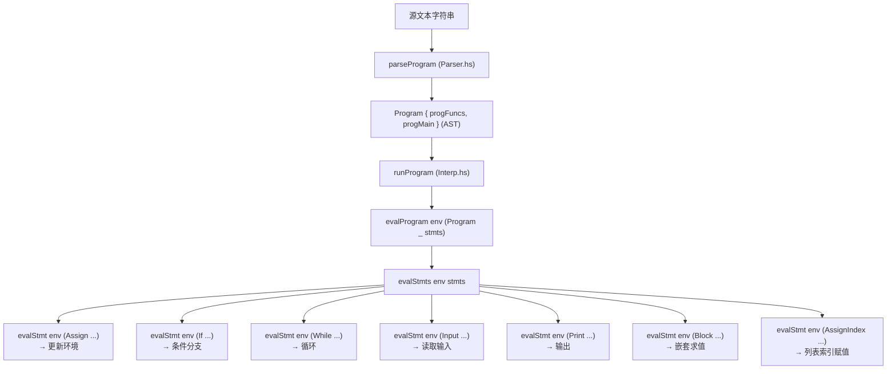

# Luguan 架构文档

## 概述

Luguan 是一个用 Haskell 编写的解释器，实现了自定义脚本语言。其架构采用经典的解释器模式: **词法/语法分析 → AST → 求值**。

---

## 模块结构

### `Types.hs` — AST 数据类型

定义所有语法树节点类型:

- **`Lit`**: 字面量（整数、布尔、空值、字符串）
- **`Expr`**: 表达式（字面量、变量、二元运算、函数调用、列表等）
- **`BinOp`**: 二元运算符（算术、比较、逻辑）
- **`Stmt`**: 语句（赋值、if、while、input、print、block、索引赋值）
- **`Type`**: 类型（int、bool、optional）
- **`Func`**: 函数定义（名称、参数列表、返回类型、函数体）
- **`Program`**: 程序（函数列表 + 主语句列表）

### `Parser.hs` — 解析器

基于 Parsec 的组合子解析器:

- **词法定义** (`langDef`): 定义注释语法（`？！` `！？`、`//`）、标识符、保留字和运算符
- **`TokenParser`**: 使用 `emptyDef` 构建的完整词法分析器
- **解析函数**:
  - `parseProgram`: 解析完整程序
  - `funcParser`: 解析函数定义
  - `stmtParser`: 解析语句（if、while、input、print、赋值、块）
  - `exprParser`: 使用 `buildExpressionParser` 处理运算符优先级
  - `termParser`: 解析基本表达式项

- 运算符优先级通过 `operatorTable` 定义，从高到低:
    1. 前缀 `!`
    2. `*` `/`
    3. `+` `-`
    4. `==` `!=` `<` `<=` `>` `>=`
    5. `&&`
    6. `||`

- 文件处理:
  - `readlgFile`: 按扩展名验证并读取文件
  - `readProgramFromFile`: 组合读取和解析

### `Interp.hs` — 解释器

基于 `ExceptT String IO` monad 转换器的 AST 求值器:

- **内部值类型** `Value`:
  - `VInt Integer`: 整数值
  - `VBool Bool`: 布尔值
  - `VUnit`: 空值（对应 `null`）
  - `VString String`: 字符串值
  - `VList [Value]`: 列表值
  - `VSome Value`: 可选类型的包装值

- **环境** `Env`: `Map.Map String Value`，变量名到值的映射

- **核心求值函数**:
  - `evalProgram`: 求值整个程序
  - `evalStmts`: 顺序求值语句列表
  - `evalStmt`: 求值单条语句
  - `evalExpr`: 求值表达式
  - `evalBinOp`: 求值二元运算

- **错误处理**: 通过 `ExceptT String IO` 提供错误信息和恢复

- **内置函数实现**: 在 `evalExpr` 中通过 `ExprFuncCall` 匹配函数名实现

### `Brainfuck.hs` — Brainfuck 解释器

独立的 Brainfuck 语言解释器:

- **指令类型** `Instr`: `Inc`、`Dec`、`Lef`、`Rig`、`Output`、`Input`、`Loop`
- **解析器** `parse`: 将 Brainfuck 源码字符串解析为指令列表
- **执行器** `exec`: 基于 State monad 的 Brainfuck 执行
- **内存模型**: 使用 `Data.Sequence` 作为可增长的内存带
- **对外接口** `bf :: [Int] -> String -> [Int]`: 接收初始内存和 Brainfuck 代码，返回输出

### `Main.hs` — 入口

- 程序入口:
    1. 从命令行参数获取文件路径
    2. 验证文件扩展名是否为 `.🦌🧪️`
    3. 读取并解析源文件
    4. 调用 `runProgram` 执行

---

## 数据流

---

## 关键设计决策

### 1. 弱类型动态检查

类型只在函数签名中声明，变量赋值时不进行类型检查。运行时值可以是任何 `Value` 类型，运算时动态检查类型匹配。

### 2. 可变环境

使用 `Map.Map String Value` 作为可变环境，每个赋值语句更新环境映射。变量作用域为全局（函数内尚未实现独立作用域）。

### 3. 列表不可变性

列表操作函数（`insert`、`replace`、`delete`）返回新列表而非原地修改，遵循函数式风格。

### 4. Brainfuck 内联

通过内置函数 `bf` 实现，在解释器中特殊处理 `ExprFuncCall "bf" args`，委托给 `Brainfuck.hs` 模块。
